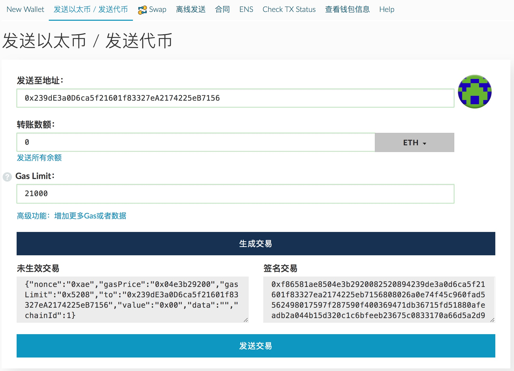

# LRC Lont-term Incentive Program

Loopring Foundation will launch“**Two Incentive Programs**”in order to motivate mid-term and long-term investors in the community.

## About Loopring Protocol
Loopring Protocol is a a decentralized automated execution system that trades across the crypto-token exchanges, shielding users from counterparty risk and reduce the cost of trading. By essentially rising the liquidity of cryptocurrencies, we are building the financial system of the future. Please visit our website for more info[https://loopring.org](https://loopring.org).

## Incentive Program

### Contract
The program will be executed through smart-contract on Ethereum network. Smart contract address：

    0x239dE3a0D6ca5f21601f83327eA2174225eB7156

ENS Address：[longterm.lrctoken.eth](https://etherscan.io/address/longterm.lrctoken.eth)。
    
The smart contract has been [etherscan.io](https://etherscan.io/address/longterm.lrctoken.eth#code)[Source Code Verified](https://etherscan.io/address/longterm.lrctoken.eth#code)，We are looking for community volunteers to help to further review。**The participartion is voluntarily for the program in accordance with smart contract code. There are risks associated with the smart contract.**。

### Rule
该计划的具体规则反映在代码里，白话文解释如下：

- 该计划激活日期为2017年8月30日下午六点。
- 路印基金会将在激活日期前转入500万LRC到该合约的地址，作为参与者的奖励；后续考虑参与金额，可能还会增加奖励数额。
- 所有通过直接转账的方式转给激励计划合约的LRC都会作为奖励的一部分，无法取出。如果您不想无偿贡献LRC，请不要直接转账任何LRC给合约地址，切记；如果您真的直接转账LRC到激励计划，我们没有能力帮您取出。
- 计划激活后，有60天的窗口期允许用户参与；窗口期关闭后，无法参与，但基金会和任何人可以继续贡献LRC奖励。
- 参与时间点之后的18个月内，该地址转入的LRC被冻结，无法取出。18个月后的任何时候，参与者都可以将LRC和奖励部分或者全部取出。该计划的强制结束日期是开始后的三年，三年后还没提现的LRC我们认为是私钥密码丢失，我们会在三年后将剩余LRC全部取出充公。
- 每个地址根据参与的时间点不一样，最早可以提LRC的时间点也不一样，越早参与，可越早提现。
- LRC奖励并不是平均分配，是根据提现顺序而定。取出同样的LRC，先提现的奖励会少，后提现的奖励会多。这一点后面有详细解读。
- 参与和提现没任何费用。部分提取时，需要为合约支付很少的LRC来指定要提现的LRC数量，地先后ETH也和LRC一并返还给用户。这一点后面有详细说明。
- 该计划没有上限，任何人都可以参与（基金会成员除外）。

具体规则以智能合约代码为基准，本文解释如果有偏差，基金会不承担任何责任。您参与就表明您充分了解合约代码。该计划开始后的执行是全自动的，基金会除了提供本说明文档外，不会提供其它技术支持。对ERC20不懂的参与者请在社区寻求帮助，但不要把私钥或密码告诉不信任的人，不要让人代为参与。

## Bouns Distribution

We estimate 100 million LRC tokens will participate the long-term program. Hypothetically total amount is 100 million LRC tokens, 那么整体的奖励为：**500万/1亿 = 5%**。为了鼓励大家长期持有，我们的奖励并非线性平均分配，而是越晚提现，奖励比例越大。从下面图形可以看出，前2/3提现的奖励比例会小于平局值，后1/3提现的奖励比例会大于平均值。奖励比例和参与时间点无关，和提现时间也无关，和提现的先后顺序有关。

Note：Interest rate will depend on the amount of your withdraw accordingly.

## Participation

### Deposit LRC

Two Steps to participate. 

1. Use LRC smart contract to authorize ERC20 - Do not send LRC indrectly from your crypto wallet or crypto-exchange.Refer to**Step A**。
2. Sned 0 Ether to incentive program's smart contract address. Refer to**Step C**。

### LRC Withdraw

For full amount withdraw after 18 months. You can just simply send 0 Ether to the incentive program's smart contract address. LRC will be send back you soon after. Refer to Step C.
For partial withdraw after 18 months，Please refer to**Step C**Set ETH in "Amount to Send" as X，then program will send you back -> X * 10,000,000 units LRC + the bonus LRC. For example if you transfer 1,000,000 LRC into our longterm program and you want to withdraw 100,000 LRC after 18 months. Therefore, you just send (100,000/10,000,000) 0.1 ETH to program smart contract address. Then we will send you 0.1ETH + 100,000LRC + Bonus LRC back all together.

## Instruction

### Step A - LRC Authorization 

1. Open MyEtherWallet（[https://www.myetherwallet.com](https://www.myetherwallet.com)）Click "Contract”.

2. Type`lrctoken.eth in “Contract Address”`;
3. Open a new window for [LRC-SmartContract ABI page](http://api.etherscan.io/api?module=contract&action=getabi&address=0xef68e7c694f40c8202821edf525de3782458639f&format=raw)，
4. Go to "MyEtherWallet" page，Copy and paste the code from"LRC-SmartContract ABI page" TO “ABI / JSON Interface”，then Click“Access”.
5. Below the “Read / Write Contract”，Click “Select a function" and Choose "approve".
6. Input contract address`0x239dE3a0D6ca5f21601f83327eA2174225eB7156`at“_spender” ,
7. Put the number of the LRC tokens you want to participate at “_value”，then add on eighteen `0`. For Example: if you want to participate 50000 LRC tokens. Input`50000000000000000000000`（Total number of Zero input:4+18=22）。
8. Access your wallet，Input the keys -> unlock，Click “Write”，send transaction. 

Alternatively, you can also use Ethereum official wallet to authorize ERC20. 

### Step B - Confrim LRC Authorization
1. Visit[LRC SmartContract page](https://etherscan.io/token/0xEF68e7C694F40c8202821eDF525dE3782458639f#readContract).

 

2. At 21st line “_owner”box -> Input your ETH address，“_spender”box ->`0x239dE3a0D6ca5f21601f83327eA2174225eB7156 `，Click“Query”.
3. The output number equals to number of LRC you participate * 1000000000000000000.

### Step C - LRC transfer Execution 
1. Open MyEtherWallet（[https://www.myetherwallet.com](https://www.myetherwallet.com)）Click “Send Ether/Tokens”.
2. Access your wallet with the key，unlock。

 
 
3. At the “To Address”line，Input`0x239dE3a0D6ca5f21601f83327eA2174225eB7156 `；Amount to send must be`0`，leave the rest as defaulted setting. Click“Generate Transaction”.

 

4. If you follow above instruction correctly，Your authorized LRC will be transferred to the incentive program.
5. If you want to withdraw the LRC tokens. The earliest time will be 18 months from participating date.

