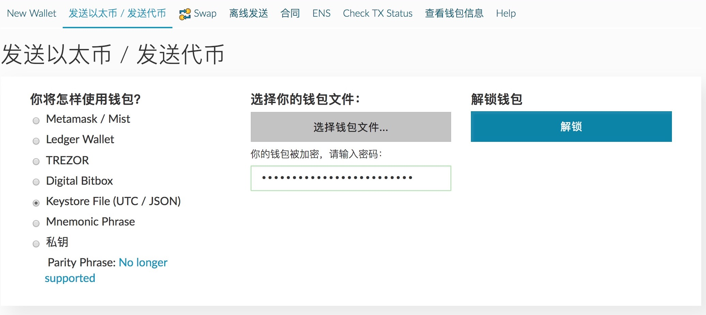
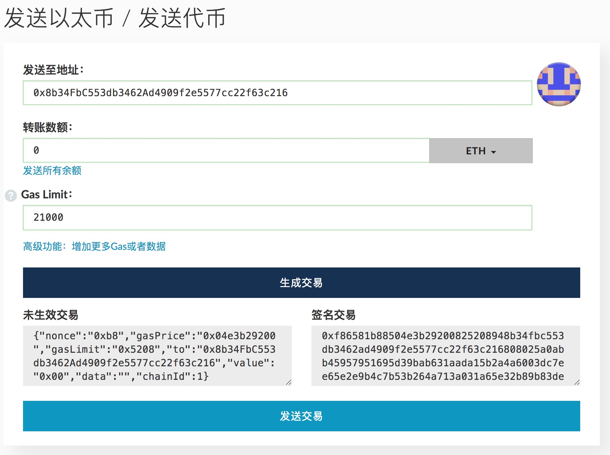

# LRC中期持有激励计划

路印基金会决定推出“**LRC持有激励计划**”，旨在激励社区中的中长期价值投资者。该**中期持有激励计划**是其中的一部分。

## 关于路印协议
路印协议（Loopring Protocol）是一个可在多条公有链上落地、代币间交易的去中心化撮合协议。其核心思想是订单生成、传播、和撮合发生在链外；交易验证和结算通过智能合约发生在链上。路印协议也引入了去中心化撮合者这个重要的生态角色，并将提供撮合挖矿软件。同时，路印协议提出了创新性的环路撮合概念，用来改善流动性和优化交易价格。路印协议的目标是真正匿名的去中心化交易，具有安全，透明，高流动性等特点。如需了解更多信息，请访问我们的官网 [https://loopring.org](https://loopring.org)。

## 为什么要激励中期持有者

我们感谢所有代币众售的参与者，但我们也意识到，有些参与者虽然也想长期持有LRC代币，但可能中短期内需要一定的ETH作为他用。这部分参与者最大的担心是一旦将手上的LRC变现，如果后续LRC价格涨幅太高就无法以原价买回LRC，会过早下车。我们希望能用基金会短期内不动用的ETH，为这部分参与者提供0成本的抵押借币服务。

## 激励计划

### 合约
该计划通过以太坊智能合约（smart-contract）实现，合约地址为：

    0x8b34FbC553db3462Ad4909f2e5577cc22f63c216

该地址对应的ENS地址为：[midterm.lrctoken.eth](https://etherscan.io/address/midterm.lrctoken.eth)。
    
我们的合约经过[etherscan.io](https://etherscan.io/address/midterm.lrctoken.eth#code)做了[源代码认证](https://etherscan.io/address/midterm.lrctoken.eth#code)，我们期待社区做深度review。**该计划完全是自愿参与，一切以代码为准，请参与者意识到合约代码的风险**。

### 规则
该计划的具体规则反映在代码里，白话文解释如下：

- 该计划激活日期为2017年8月30日下午六点，兑换窗口期为60天，在这60天内，任何人都可用LRC兑换ETH，兑换价格为7500 LRC/ETH。
- 路印基金会视情况，会在兑换窗口期内，计划转入5000ETH（该额度完全有基金会自主决定，可随意更改）。
- 所有通过直接转账的方式转给激励计划合约的LRC都将被视为捐赠，用户无法取出，基金会也不会提供任何技术帮助。如果您不想无偿捐赠LRC，请不要直接转账任何LRC给合约地址，切记；如果您真的直接转账LRC到激励计划，我们不会帮您取出。
- 参与时间点之后的6个月内，该地址抵押的LRC被冻结，无法通过还ETH换回。参与时间点6个月后到参与时间点9个月前的任何时候，参与者都可以将ETH转账给合约地址，将LRC原数量换回。参与时间点9个月后，该地址转入的LRC无法换回，归基金会所有，ETH也不必偿还。
- 每个地址根据参与的时间点不一样，最早可以提LRC的时间点也不一样，越早参与，可越早提现。
- 每个地址参与的最高额度是（15万LRC，即20ETH），参与和提现没任何费用。
- 该计划任何人都可以参与（基金会成员除外）。

具体规则以智能合约代码为基准，本文解释如果有偏差，基金会不承担任何责任。您参与就表明您充分了解合约代码。该计划开始后的执行是全自动的，基金会除了提供本说明文档外，不会提供其它技术支持。对ERC20不懂的参与者请在社区寻求帮助，但不要把私钥或密码告诉不信任的人，不要让人代为参与。

## 参与方式

### 充值LRC换ETH

参与方式其实很简单，分两个步骤：

1. 通过LRC智能合约做ERC20授权 - 切勿用钱包或者从交易所直接转账LRC给激励计划合约地址，除非您想免费提供LRC奖励。见附录**操作A**。
2. 转账0个ETH给激励计划合约地址。见附录**操作C**。一旦转账成功，ETH就会自动发到您的地址。

### 还ETH提现LRC

还ETH更简单，只需要在参与后的6到9个月之间，将您借到的ETH从原来的地址部分或全部转账给合约地址就可以了，您的LRC会实时转账到您的地址。

## 附录

### 操作A - LRC授权

1. 打开MyEtherWallet（[https://www.myetherwallet.com](https://www.myetherwallet.com)）点击“合同”或“Contract”标签。

2. 在“Contract Address”中填入`lrctoken.eth`;
3. 新开一个窗口，访问 [LRC代币智能合约的ABI页面](http://api.etherscan.io/api?module=contract&action=getabi&address=0xef68e7c694f40c8202821edf525de3782458639f&format=raw)，拷贝所有文本内容。
4. 返回MyEtherWallet页面，在“ABI / JSON Interface”中粘贴上一步的文本信息，点击“Access”按钮。
5. 在“Read / Write Contract”下方，点击“Select a function”按钮，选择approve。
6. 在“_spender”中填入`0x8b34FbC553db3462Ad4909f2e5577cc22f63c216`,
7. 在“_value”中填入您要参与的LRC数量，后面输入18个`0`。比如您要参与5万LRC，输入`50000000000000000000000`（共4+18=22个0）。
8. 之后选择您的钱包文件，输入密码，解锁，之后点击“Write”按钮，发送交易。

您也可以选择以太坊官方钱包做ERC20授权，操作步骤差不多。

### 操作B - LRC授权查询
1. 访问[LRC代币智能合约页面](https://etherscan.io/token/0xEF68e7C694F40c8202821eDF525dE3782458639f#readContract)。

 

2. 在表格的第21项中 “_owner” 中填入你自己的以太坊地址，“_spender”中填入`0x8b34FbC553db3462Ad4909f2e5577cc22f63c216 `，点击“Query”。
3. 查询结果去掉后面的18个0，就是您的授权数额。

### 操作C - 触发LRC转账
1. 打开MyEtherWallet（[https://www.myetherwallet.com](https://www.myetherwallet.com)）点击“发送以太/发送代币”标签。
2. 选择钱包文件，输入密码，点击解锁。

 
 
3. 在表格的“发送至地址”中，填入`0x8b34FbC553db3462Ad4909f2e5577cc22f63c216 `；转账数额一定填写您想还的ETH金额，其它用默认值，点击“生成交易”,点击发送交易即可。

 

4. 不出意外，您通过ERC20授权的所有LRC都会被转移到激励计划的合约地址中去。
5. 如果您希望尽早提现，请记住自己的操作时间，6到9个月间可换汇LRC。

