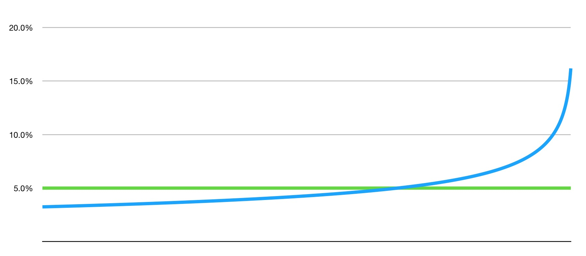
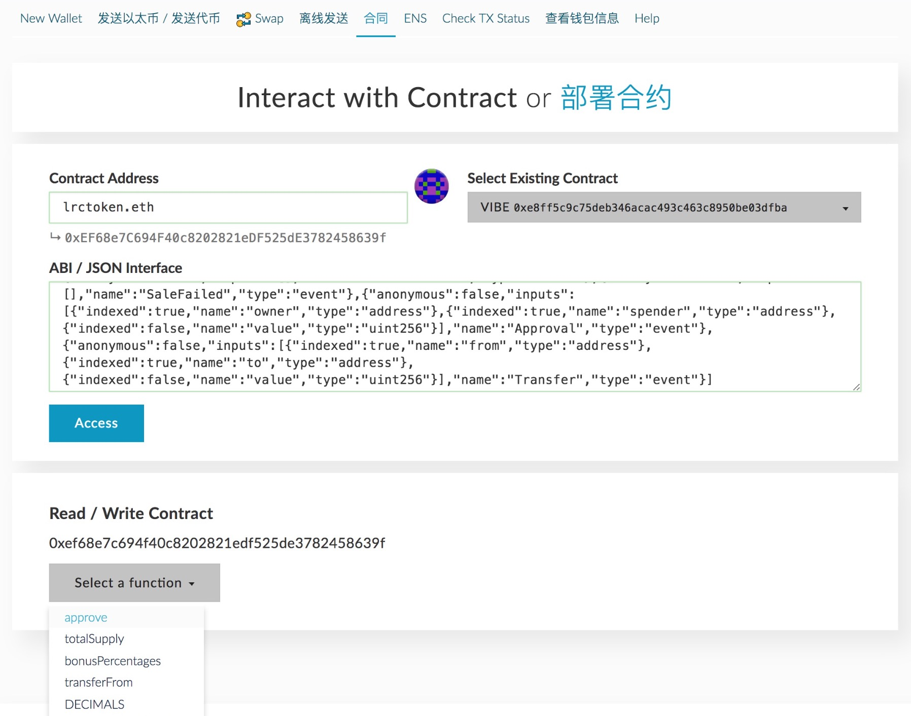
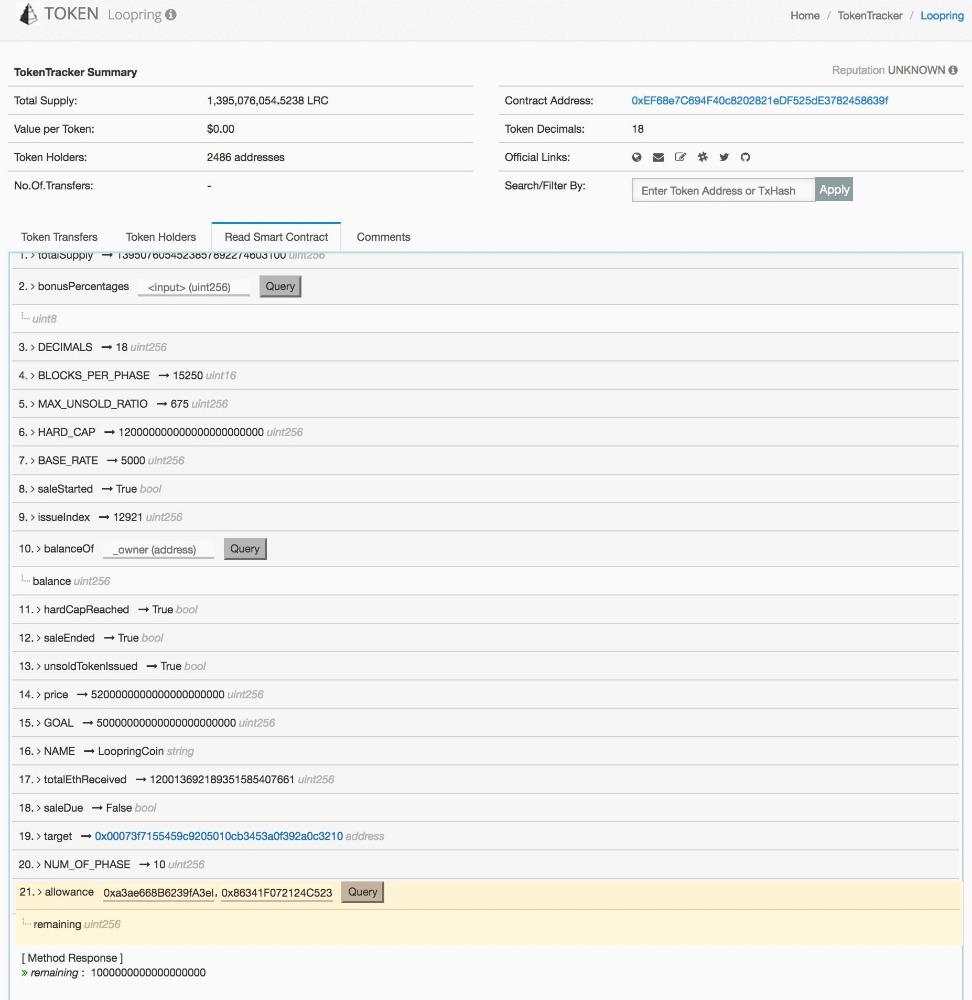

# LRC长期持有激励计划

路印基金会决定推出“**LRC长期持有激励计划**”，旨在激励社区中的长期价值投资者。

## 关于路印协议
路印协议（Loopring Protocol）是一个可在多条公有链上落地、代币间交易的去中心化撮合协议。其核心思想是订单生成、传播、和撮合发生在链外；交易验证和结算通过智能合约发生在链上。路印协议也引入了去中心化撮合者这个重要的生态角色，并将提供撮合挖矿软件。同时，路印协议提出了创新性的环路撮合概念，用来改善流动性和优化交易价格。路印协议的目标是真正匿名的去中心化交易，具有安全，透明，高流动性等特点。

## 为什么要激励长期持有者

路印协议要解决的问题市场规模很大，但技术难度也不容小觑。研发和项目落地都需要时间。基金会的主要精力在于研发和生态建设，而不是人为干预市场价格去实现短期套利。但我们也意识到稳定的LRC价格对于投资者和团队信心的重要性。我们希望通过激励LRC的长期持有者，可以一定程度稳定LRC的价格；同时为长期持有者带来回报。

## 激励计划

### 合约
该计划通过以太坊智能合约（smart-contract）实现，只有在计划启动的瞬间需要基金会的一次启动授权。后续基金会没有任何特殊权利，即对合约逻辑及其内部价值没有任何可操作的空间。合约地址为：

    0x239dE3a0D6ca5f21601f83327eA2174225eB7156

该地址对应的ENS地址为：[longterm.lrctoken.eth](https://etherscan.io/address/longterm.lrctoken.eth)。
    
我们的合约经过[etherscan.io](https://etherscan.io/address/longterm.lrctoken.eth#code)做了[源代码认证](https://etherscan.io/address/longterm.lrctoken.eth#code)，我们期待社区做深度review。**该计划完全是自愿参与，一切以代码为准，请参与者意识到合约代码的风险**。

### 规则
该计划的具体规则反映在代码里，白话文解释如下：

- 该计划激活日期为2017年8月30日下午六点。
- 路印基金会将在激活日期前转入500万LRC到该合约的地址，作为参与者的奖励。
- 所有通过直接转账的方式转给激励计划合约的LRC都会作为奖励的一部分，无法取出。如果您不想无偿贡献LRC，请不要直接转账任何LRC给合约地址，切记；如果您真的直接转账LRC到激励计划，我们没有能力帮您取出。
- 计划激活后，有60天的窗口期允许用户参与；窗口期关闭后，无法参与，但基金会和任何人可以继续贡献LRC奖励。
- 参与时间点之后的18个月内，该参与者的LRC被冻结，无法取出。18个月后的任何时候，参与者都可以将LRC和奖励部分或者全部取出。该计划的强制结束日期是开始后的三年，三年后还没提现的LRC我们认为是私钥密码丢失，我们会在三年后将剩余LRC全部取出充公。
- 每个人根据参与的时间点不一样，最早可以提LRC的时间点也不一样，越早参与，可越早提现。
- LRC奖励并不是平均分配，是根据提现顺序而定。取出同样的LRC，先提现的奖励会少，后提现的奖励会多。这一点后面有详细解读。
- 参与和提现没任何费用。部分提取时，需要为合约支付很少的LRC来指定要提现的LRC数量，地先后ETH也和LRC一并返还给用户。这一点后面有详细说明。
- 该计划没有上限，任何人都可以参与。

## 奖励分配

我们预计社区的参与额度应该在1亿LRC左右。如果按照1亿LRC预估，那么整体的奖励为：**500万/1亿 = 5%**。为了鼓励大家长期持有，我们的奖励并非线性平均分配，而是越晚提现，奖励比例越大。从下面图形可以看出，前2/3提现的奖励比例会小于平局值，后1/3提现的奖励比例会大于平均值。奖励比例和参与时间点无关，和提现时间也无关，和提现的先后顺序有关。

注：上图依据您提现额度的不同会造成统计结果的不同。

## 参与方式

### 充值LRC

参与方式其实很简单，分两个步骤：

1. 通过LRC智能合约做ERC20授权 - 切勿用钱包或者从交易所直接转账LRC给激励计划合约地址，除非您想免费提供LRC奖励。见附录**操作A**。
2. 转账0个ETH给激励计划合约地址。见附录**操作C**。

### 提现LRC

如果您想全部提现，在参与的18各月后，您需从参与地址中打0个ETH到激励计划合约地址即可，您的LRC和奖励会实时返还到您的地址。见附录操作C。

如果您想部分提现，可以在附录**操作C**中将ETH金额设为某个值 X，激励计划合约地址会为您转出最多 X * 10,000,000 个LRC和其对应的奖励。比如您当初参与额度是100万LRC，现在想取出10万LRC，只需转 100,000/10,000,000 = 0.1ETH给只能合约。您的ETH，原始LRC和奖励部分会一并打回。

## 附录

### 操作A - LRC授权

1. 打开MyEtherWallet（[https://www.myetherwallet.com](https://www.myetherwallet.com)）点击“合同”或“Contract”标签。

2. 在“Contract Address”中填入`lrctoken.eth`;
3. 新开一个窗口，访问 [LRC代币智能合约的ABI页面](http://api.etherscan.io/api?module=contract&action=getabi&address=0xef68e7c694f40c8202821edf525de3782458639f&format=raw)，拷贝所有文本内容。
4. 返回MyEtherWallet页面，在“ABI / JSON Interface”中粘贴上一步的文本信息，点击“Access”按钮。
5. 在“Read / Write Contract”下方，点击“Select a function”按钮，选择approve。
6. 在“_spender”中填入`0x239dE3a0D6ca5f21601f83327eA2174225eB7156`,
7. 在“_value”中填入您要参与的LRC数量，后面输入18个`0`。比如您要参与5万LRC，输入`50000000000000000000000`（共4+18=22个0）。
8. 之后选择您的钱包文件，输入密码，解锁，之后点击“Write”按钮，发送交易。

您也可以选择以太坊官方钱包做ERC20授权，操作步骤差不多。

### 操作B - LRC授权查询
1. 访问[LRC代币智能合约页面](https://etherscan.io/token/0xEF68e7C694F40c8202821eDF525dE3782458639f#readContract)。

 

2. 在表格的第21项中 “_owner” 中填入你自己的以太坊地址，“_spender”中填入`0x239dE3a0D6ca5f21601f83327eA2174225eB7156 `，点击“Query”。
3. 查询结果去掉后面的18个0，就是您的授权数额。

### 操作C - 触发LRC转账
1. 打开MyEtherWallet（[https://www.myetherwallet.com](https://www.myetherwallet.com)）点击“发送以太/发送代币”标签。
2. 选择钱包文件，输入密码，点击解锁。

 
 
3. 在表格的“发送至地址”中，填入`0x239dE3a0D6ca5f21601f83327eA2174225eB7156 `；转账数额一定填写`0`，其它用默认值，点击“生成交易”,点击发送交易即可。

 

4. 不出意外，您通过LRC授权的所有LRC都会被转移到激励计划的合约地址中去。
5. 如果您希望尽早提现，请记住自己的操作时间，18个月后既可提现。

注意：第3步的转账数额一定是0，我们不接受ETH的捐赠。

